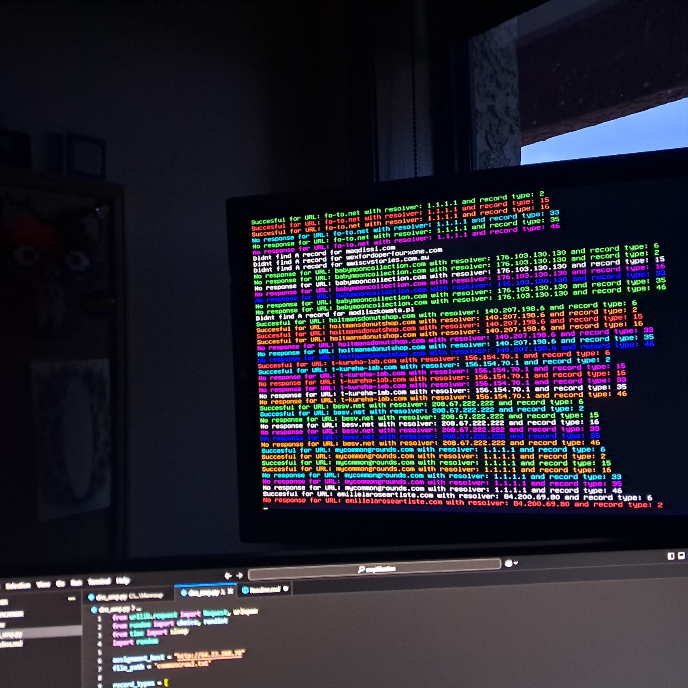

# DNS Amplification Challenge
```
          _   _______    ___  __   __ _______ 
    /\   | \ | \  ___)  / _ \|  \ /  (   _   )
   /  \  |  \| |\ \    | |_| |   v   || | | | 
  / /\ \ |     | > >   |  _  | |\_/| || | | | 
 / /__\ \| |\  |/ /__  | | | | |   | || | | | 
/________\_| \_/_____) |_| |_|_|   |_||_| |_| 
```
This project was created for the DNS Amplification Challenge in the COSC 417 Topics in Networking course. The goal of this challenge is to identify the combination of DNS resolvers, domains and query types (`qtypes`) that result in the highest amplification ratios.

Shoutouts to CommonCrawl.org for crawling and gathering lists of domains.



## Description

DNS amplification is a type of Distributed Denial of Service (DDoS) attack where an attacker exploits the functionality of open DNS resolvers to flood a target with a large amount of traffic. This script helps in identifying which DNS query types have the highest amplification ratios by measuring the size of the response relative to the size of the request.

## Features

- Instead of having to crawl by yourself to find domains, uses data provided by CommonCrawl.org 
- Checks if a domain has an A record before making further requests.
- Chooses a random resolver and iterates over selected qtypes to send requests to the challenge host.
- Calculates the amplification factor and if it is high, the domain, resolver and qtype are logged which can be used for further manual testing.
- Can use the multithreaded script so the dns calculation requests don't block the api requests.
- The commoncrawl domains file is big, but I still chose to load the entire thing in memory. If this causes issues, please download more RAM (https://downloadmoreram.com/download.html).

## Usage

1. **Prerequisites**:
   - Python 3.x
   - Required Python packages: `urllib`, `random`
2. **Setup**:
   - Ensure you have the required Python packages installed.
   - Dowload the latest "domain-vertices" file from https://commoncrawl.org/web-graphs (I used cc-main-2024-sep-oct-nov-domain-vertices.txt.gz)
   - Place your domain vertices data file in the appropriate directory.
3. **Running the Script**:
   - Update the `file_path` variable to point to your domain vertices data file.
   - Run either the normal or multithread script (probably a good idea to use a "screen" session)

## EULA

By using this software, you agree to the following terms and conditions, which are legally binding:

1. **Usage Rights**: You may use this software for any legal purpose, including but not limited to, impressing your friends, confusing your enemies, and pretending you know what DNS amplification is.

2. **Warranty Disclaimer**: This software is provided "as is", without any warranty of any kind. If it breaks, you get to keep both pieces. We are not responsible for any damage, including but not limited to, loss of data, loss of sanity, or spontaneous combustion of your computer. It may or may not send all your personal data to me.

3. **Limitation of Liability**: In no event shall the authors be liable for any damages arising from the use or misuse of this software. This includes, but is not limited to, damages for loss of profits, goodwill, use, data, or other intangible losses (even if we have been advised of the possibility of such damages). If your computer turns into a sentient being and starts plotting world domination, that's on you.

4. **Redistribution**: You are free to redistribute this software, provided you do not claim it as your own work. If you do, we will send a horde of angry DNS packets to your IP address.

5. **Governing Law**: This EULA shall be governed by and construed in accordance with the laws of the Internet. Any disputes arising under or in connection with this EULA shall be resolved by a 1v1 on Rust (the cod map, not the game).

6. **Termination**: This EULA is effective until terminated. You may terminate it at any time by destroying all copies of the software in your possession. We may terminate it if you fail to comply with any term or condition of this EULA, or if we just feel like it.

7. **Miscellaneous**: If any provision of this EULA is found to be unenforceable, the remaining provisions will remain in full force and effect. This EULA constitutes the entire agreement between you and us regarding the use of this software, and supersedes all prior agreements and understandings, whether written or oral.

By continuing to use this software, you acknowledge that you have read, understood, and agreed to be bound by this EULA. If you do not agree, please uninstall the software and find something else to do with your time.
